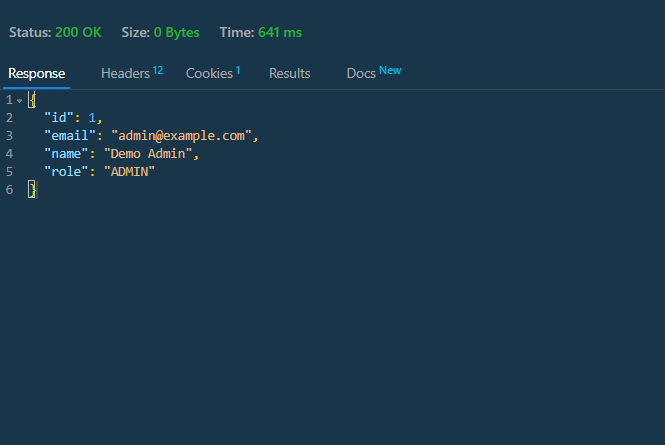
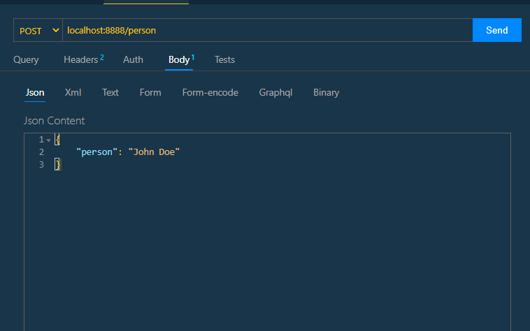
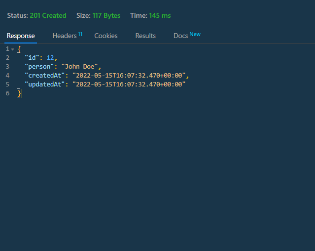
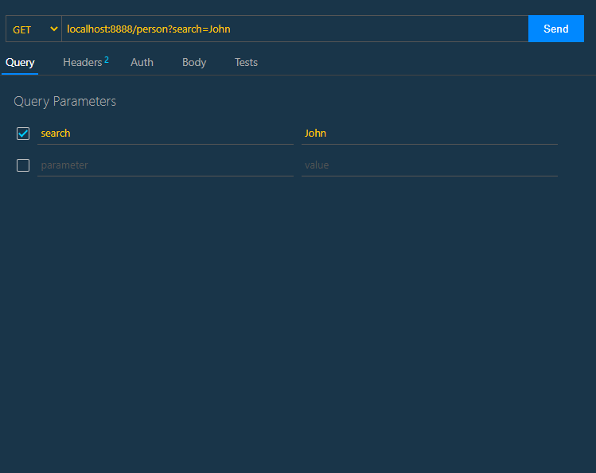
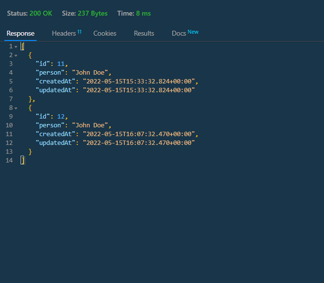

## Moderan Home Task

A simple api task for moderan using Java Spring Boot


## :triangular_flag_on_post: Table of Contents

- [Installation](#installation)
- [Usage](#usage)
- [Testing](#testing)
- [Note](#note)
- [Contributing](#contributing)
- [Author](#author)
- [License](#license)

## Installation :computer:
Follow these steps:

### 1. Clone the project 

```bash
git clone git@github.com:ashfaqshuvo007/moderan-springboot-api.git
```
### 2. DB Setup (Postgres) 
- login to Postgres
Open your terminal and type the following command
```bash
psql -d postgres -U postgres -W
```
Enter your **password** when prompted.
- Create a new Database
```bash
CREATE DATABASE myDatabase WITH ENCODING 'UTF8' LC_COLLATE='English_United Kingdom' LC_CTYPE='English_United Kingdom';
```
- Create a new User
```bash
CREATE USER user_name WITH ENCRYPTED PASSWORD 'mypassword';
```
- Grant all privileges to the user for the new database
```bash
GRANT ALL PRIVILEGES on DATABASE myDatabase to user_name;
```
### 2.Application.Properties file 

- Copy the following into application.properties file
```

spring.sql.init.mode = always
spring.sql.init.platform = postgres
spring.datasource.url = jdbc:postgresql://localhost:5432/moderan
spring.datasource.username = moderan
spring.datasource.password = moderan
spring.jpa.properties.hibernate.jdbc.lob.non_contextual_creation = true
spring.jpa.properties.hibernate.dialect = org.hibernate.dialect.PostgreSQLDialect
# Hibernate ddl auto (create, create-drop, validate, update)
spring.jpa.hibernate.ddl-auto = update
spring.jpa.defer-datasource-initialization = true
spring.jpa.show-sql=true

#server port
server.port=8888

# Banner
spring.banner.location=classpath:banner.txt
```
## Usage

1.Build and Run the project

 We have used gradle for this project.

```bash
gradle bootRun
```
It will start the server at port 8888 as mentioned in the application.properties file. If you want you can change it to your convinience. Also it will create necessary databases and Put One user inside users tables as admin.

- You can check user package in [users folder](src/main/java/com/moderan/hometask/users)

This is just to handle some permissions for our main api routes.

### For Person package

You can look at [Person Folder](src/main/java/com/moderan/hometask/person/)


## API routes 
I have used thunder client of Vscode but you use your browser or POSTMAN to test the endpoints.


**Authentication**

For authentication, we have used a Basic Auth (username & password): ```localhost:8888/auth``` return a user json object with details. You are authenticated.

- Auth route setup


- Response

 


**We have two main routes**:

1. To save a Person ```"/person"``` **POST METHOD** permitted only to users with role **ADMIN**

- POST url and input body. It takes a json in the following format



- Response: returns a new created Person Object with timestamp and id.




2. To retrieve list of records matching a search string a Person ```"/person?search=John"``` GET METHOD permitted to ALL
Let's say we want to retrieve all rows of data with 'John' in any column. We put a query parameter 'search' and its value as 'John'

- GET url and input body. It takes a json in the following format



- Response: returns a json list of all the records with 'John' 



## Testing 

I implemented a simple test which you can find [here](src/test/java/com/moderan/hometask/HometaskApplicationTests.java)

## Improvements:
- I would have loved to have more tests(Unit and integration test with Mockito)
- Error Handling can be much better with custom Error handlers 
- Implementing CORS for the endpoints

## Author

**Ashfaq Hussain Ahmed**
- [LinkedIn](https://www.linkedin.com/in/ashfaqhahmed/)

## License
[MIT](https://choosealicense.com/licenses/mit/)